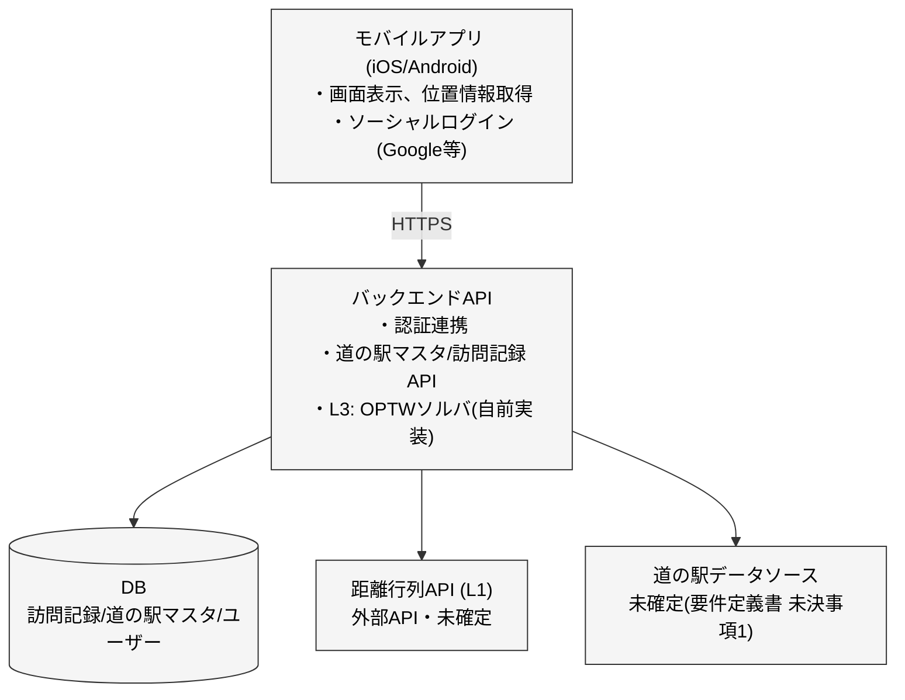

# システム構成・レイヤー構成

## 1. 全体構成図

要件定義書 4.2「推奨アーキテクチャ」のL1/L2/L3分解を、モバイルアプリ前提で具体化する。

> **モバイルアプリのみで完結させない理由**: L3(OPTWソルバ)は道の駅マスタ全体を対象にした計算になり得るため、端末側で完結させるとデータ配布量・計算負荷の両面で不利。また訪問記録はユーザーをまたいで永続化する必要があるため、バックエンドを持つ構成とする。

## 2. レイヤーと本設計書の対応

| レイヤー | 要件定義書での位置づけ | 本設計書での実装箇所 |
|---------|----------------------|---------------------|
| L1. 2点間距離・時間 | 外部API一択 | バックエンド→距離行列API([03_external-interfaces.md](./03_external-interfaces.md)) |
| L2. 巡回順序の最適化 | 外部API＋補正 | バックエンド(L3の一部として扱う。MVPでは独立したL2呼び出しは設けず、L3ソルバに内包する) |
| L3. 訪問対象選択＋時間枠 | 自前実装必須 | バックエンド、独自ロジック(本設計書では入出力の境界のみ定義し、アルゴリズム自体は別途詳細設計する) |

> L3のアルゴリズム設計(要件定義書 未決事項2)は外部設計の対象外とし、内部設計以降で詰める。外部設計としては「入力: 現在地・出発時刻・帰着希望時刻・道路条件・候補道の駅」「出力: 訪問順・各拠点到着/出発予定時刻」という**インターフェース境界**のみを定義する。

## 3. クライアント/サーバーの責務分担

| 責務 | モバイルアプリ | バックエンドAPI |
|------|---------------|-----------------|
| 現在地取得 | ○ | - |
| ログイン | ○(SDK呼び出し) | ○(トークン検証) |
| 経路最適化(L1〜L3) | - | ○ |
| 道の駅マスタ・観光地データ保持 | キャッシュのみ | ○(正) |
| 訪問記録の保存 | - | ○ |
| オフライン時の一覧表示 | ○(キャッシュから) | - |

## 4. 技術選定について

具体的な技術スタック(モバイルのフレームワーク、バックエンドの言語・フレームワーク、DB製品、距離行列APIのベンダー等)は内部設計以降で決定する。本設計書では「モバイルアプリ + バックエンドAPI + 外部API」という構成レベルの決定のみを行う。
