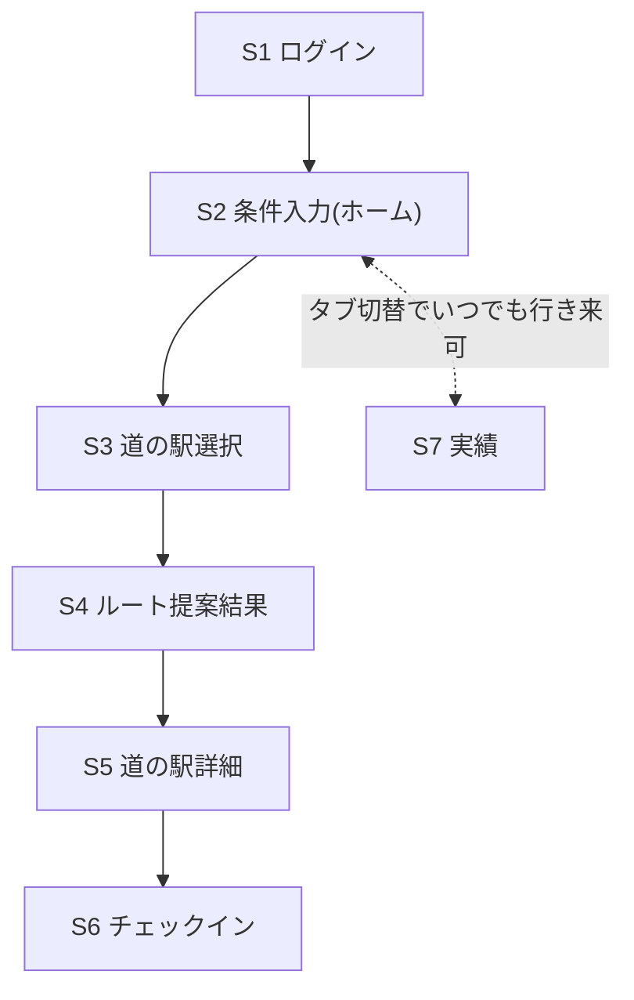

# 画面一覧・画面遷移(MVP)

## 1. 画面一覧

| # | 画面名 | 概要 | 対応要件 |
|---|--------|------|---------|
| S1 | ログイン | ソーシャルログイン(Google等)で認証する | ユーザー管理(前提決定事項) |
| S2 | 条件入力(ホーム) | 現在地・出発時刻・帰着希望時刻(または所要時間上限)・道路条件(高速回避)を入力する | FR-1.1, FR-1.4 |
| S3 | 道の駅選択 | 周遊対象にしたい道の駅を選ぶ、または「おまかせ」で自動選定する | FR-1.2, FR-1.3(※選定方式は [99_open-issues.md](./99_open-issues.md) 参照) |
| S4 | ルート提案結果 | 算出された周遊順序・地図・到着予定時刻を表示する | FR-1.3, FR-1.5 |
| S5 | 道の駅詳細 | 施設情報(レストラン・売店・営業時間)、人気度、トイレの清潔さを表示する | FR-2.1, FR-2.2 |
| S6 | チェックイン | 道の駅を訪問済みとして記録する | FR-3.1 |
| S7 | 実績 | 都道府県別・全国の達成率を表示する | FR-3.2 |

> 周辺観光(FR-2.3)はMVPスコープの「含める」表に明記されておらず、対象画面なし。対象にするか要確認([99_open-issues.md](./99_open-issues.md) に記載)。
> バッジ・キャラ等の収集要素(FR-3.3)はMVP見送りのため、S7に専用UIは設けない。

## 2. 画面遷移(骨格)

- S2〜S4が経路最適化ドメイン(FR-1)の主動線。
- S5〜S6が情報提供・記録ドメイン(FR-2, FR-3)の動線で、S4からだけでなく単独でも(実際に道の駅に到着した際など)アクセスできるようにする想定。
- S7(実績)はタブ等で常時アクセス可能な独立画面とする。

## 3. 各画面の詳細化について

各画面の入力項目のバリデーション、エラー時の挙動、詳細UIレイアウトは本ドキュメントでは定義しない。実装に着手する画面から順に、このファイルの該当セクションへ追記していく。
