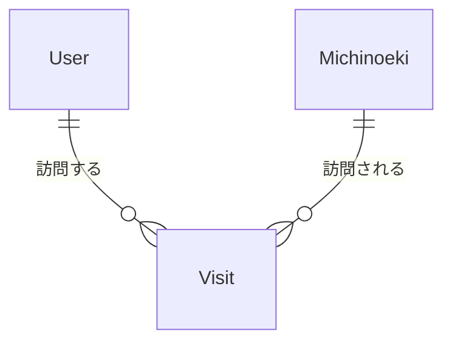

# データモデル(概念レベル)

具体的なDB製品・テーブル定義(型・インデックス等)は内部設計で決定する。ここではエンティティと属性、関連のみを定義する。

## 1. 概念ER図

- 1人のUserは複数のVisit(訪問記録)を持つ
- 1つのMichinoeki(道の駅)は複数のUserから複数回Visitされうる

## 2. エンティティ一覧

### User(ユーザー)

| 属性 | 説明 |
|------|------|
| user_id | ID(ソーシャルログインの認証主体と紐づく) |
| display_name | 表示名 |
| email | ソーシャルログインから取得 |
| created_at | 登録日時 |

### Michinoeki(道の駅マスタ)

| 属性 | 説明 | 対応要件 |
|------|------|---------|
| michinoeki_id | ID | - |
| name | 名称 | - |
| prefecture | 都道府県 | FR-3.2(都道府県別達成率) |
| address | 住所 | - |
| location(lat, lng) | 緯度経度 | FR-1系全般 |
| business_hours | 営業時間(施設全体、曜日別) | FR-1.2, FR-2.1 |
| regular_holiday | 定休日 | FR-1.2 |
| temporary_closure | 臨時休業情報 | FR-1.2(更新頻度が高くNFR-2と関連) |
| facilities | レストラン・売店の有無と営業時間 | FR-2.1 |
| popularity_score | 人気度(表示のみ、MVP) | FR-2.2 |
| toilet_rating | トイレの清潔さ(表示のみ、MVP) | FR-2.2 |
| data_source | データ取得元 | NFR-2 |
| updated_at | データ更新日時(鮮度管理) | NFR-2 |

> データ調達方法(機械可読取得/手入力/クラウドソーシング)は要件定義書 未決事項1で未確定。本設計書では属性構造のみ定義し、取得・更新の運用方式は別途決定する。

### Visit(訪問記録)

| 属性 | 説明 |
|------|------|
| visit_id | ID |
| user_id | Userへの参照 |
| michinoeki_id | Michinoekiへの参照 |
| visited_at | 訪問日時(チェックイン日時) |

### RouteRequest / RouteResult(経路最適化の入出力)

DB永続化の要否はMVPでは未確定(単発の計算リクエストとしてその場限りで扱うか、履歴として保存するか)。[00_overview.md](./00_overview.md) のL3境界定義に対応する入出力の形のみ、参考として記載する。

| 入力(RouteRequest) | 説明 |
|---------------------|------|
| current_location | 現在地(lat, lng) |
| departure_time | 出発時刻 |
| time_budget | 帰着希望時刻 or 所要時間上限 |
| avoid_highway | 高速道路回避フラグ |
| candidate_michinoeki_ids | 対象候補の道の駅ID群 |

| 出力(RouteResult) | 説明 |
|---------------------|------|
| ordered_stops | 訪問順の道の駅IDリスト、各拠点の到着/出発予定時刻 |
| total_distance | 総距離 |
| total_duration | 総所要時間 |

## 3. MVPで対象外のエンティティ

- TouristSpot(周辺観光): FR-2.3対応。MVPスコープに含まれるか未確定([99_open-issues.md](./99_open-issues.md))
- Badge / Character(バッジ・キャラ等): FR-3.3対応。MVP見送り
